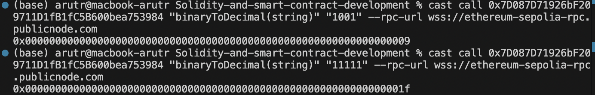
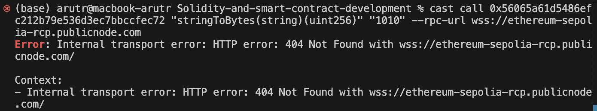
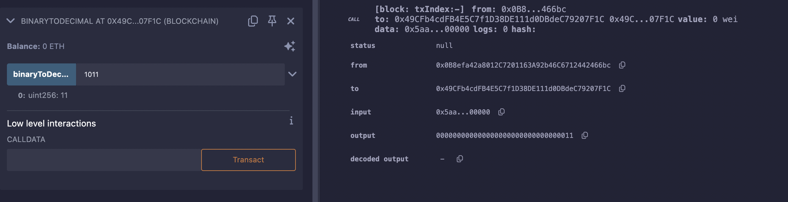

# Part C - RPC with Foundry Cast (1 + 1 points)

Deployer: 0x0B8efa42a8012C7201163A92b46C6712442466bc
Deployed to: 0x7D087D71926bF209711D1fB1fC5B600bea753984
Transaction hash: 0x8ecfe2476ad6702922a4bdf8ce03c8d8897f24ccbf2bf5b472da0cd9742ea48f

wss://ethereum-sepolia-rpc.publicnode.com

To verify the deployment, I called my own contract and this was the output:

Not entirely expected, as it is in hexadecimal rather than decimal, but nontheless the calling worked.

I then attempted to cast call Kathleen's contract with foundry on the terminal in VSCode, but was unable to call it prepertly and was instead met with "Error: Internal transport error: HTTP error: 404 Not Found with wss://ethereum-sepolia-rcp.publicnode.com/". While the issue is seemingly with the rpc, it was confirmed to me that the contract was deployed succesfully at that url.

Later I called Jinane's contract on Remix, which was successful. Incidentally, calling my contract on Remix resulted in a uint256 decimal output rather than hexadecimal.
