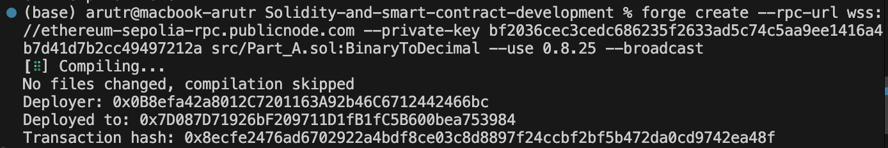
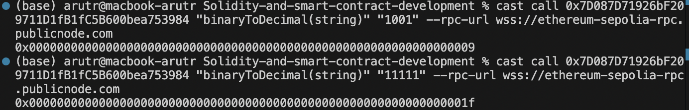
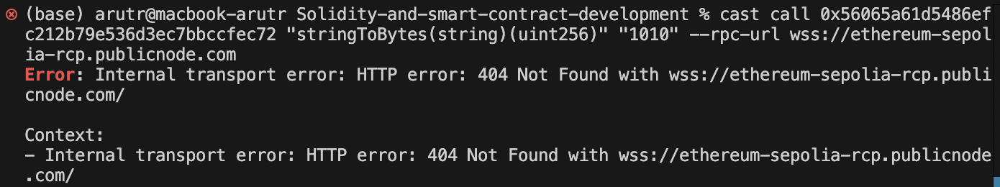
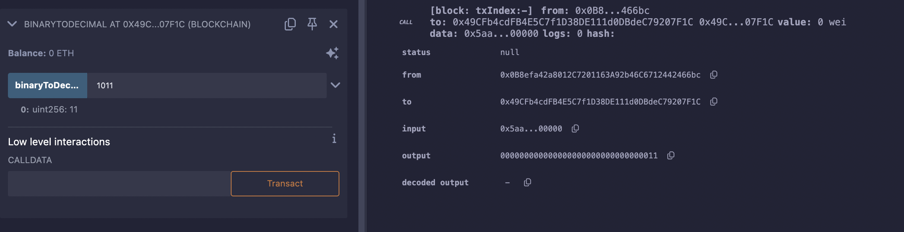

# Exercise 2

## Part C

To verify the deployment, I called my own contract and this was the output:

Not entirely expected, as it is in hexadecimal rather than decimal, but nontheless the calling worked.

I then attempted to cast call Kathleen's contract with foundry on the terminal in VSCode, but was unable to call it prepertly and was instead met with "Error: Internal transport error: HTTP error: 404 Not Found with wss://ethereum-sepolia-rcp.publicnode.com/". While the issue is seemingly with the rpc, it was confirmed to me that the contract was deployed succesfully at that url.

Later I called Jinane's contract on Remix (output attached below), which was successful. Incidentally, calling my contract on Remix resulted in the desired decimal output rather than hexadecimal.

